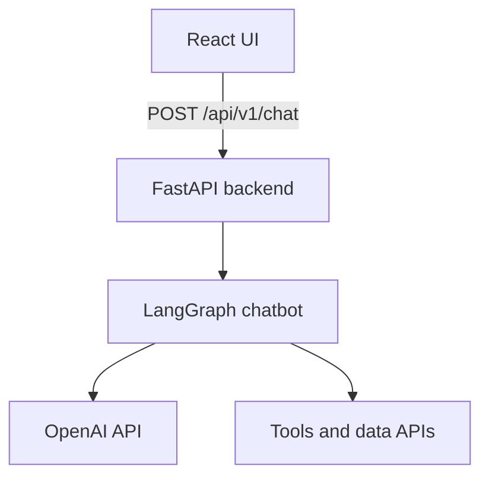

# Architecture

High-level flow you’re aiming for — and how this repo implements it.

## Target stack (your brief)

```
┌─────────────────┐
│   React UI      │  Chat, sends conversation to API
└────────┬────────┘
         │ HTTP (JSON)
         ▼
┌─────────────────┐
│ FastAPI backend │  Routes, auth, rate limits, CORS, health
└────────┬────────┘
         │ invokes
         ▼
┌─────────────────┐
│ LangGraph       │  Agent graph: LLM ↔ tools loop (no MemorySaver)
│ chatbot logic   │  RAG context injected once per request
└────────┬────────┘
         │
         ▼
┌─────────────────┐
│ OpenAI / tools  │  GPT (chat + tool calls), Playwright (web),
│ / APIs          │  Chroma + embeddings (RAG store)
└─────────────────┘
```

## Same flow as a diagram (Mermaid)



## What lives where

| Layer | In this repo | Role |
|--------|----------------|------|
| **React UI** | `frontend/` | Calls `/api/v1/chat`, keeps message history in the browser |
| **FastAPI** | `backend/app/main.py`, `api/v1/` | HTTP API, validation, optional Bearer auth, rate limits |
| **LangGraph** | `backend/app/services/agent_service.py` | `chatbot` node + `ToolNode` (`scrape_text`, `scrape_and_ingest`) |
| **OpenAI** | `ChatOpenAI`, `OpenAIEmbeddings` | LLM + embeddings |
| **Tools / APIs** | Playwright (`browser_service`), Chroma (`rag_service`), `/api/v1/ingest`, `/api/v1/ingest-db` | Text/PDF ingestion + vector store |

## Data flow (one chat request)

1. UI sends `{ messages: [...] }` to FastAPI.
2. FastAPI builds LangChain messages and calls `AgentService.ainvoke`.
3. **RAG**: relevant chunks from Chroma are added as a single system context (not conversational memory).
4. **LangGraph** runs: model may call Playwright tools, then answer.
5. Assistant text is returned to the UI.

## Optional extension

- Add more tools (HTTP APIs, DB, etc.) beside Playwright by registering them on the same LangGraph graph.
- For multi-tenant or long-term memory, add a **database** behind FastAPI (separate from RAG documents).
